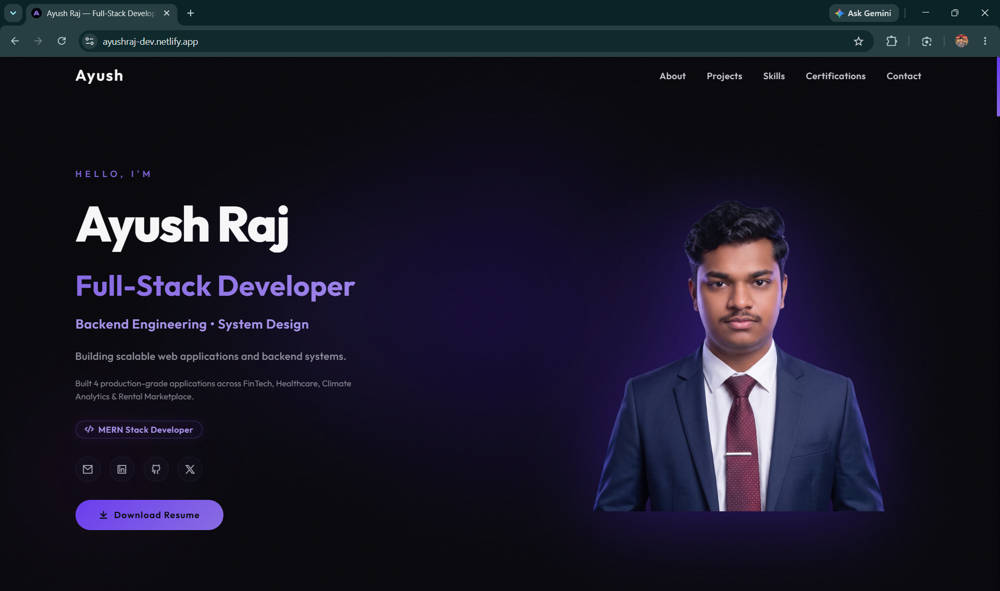
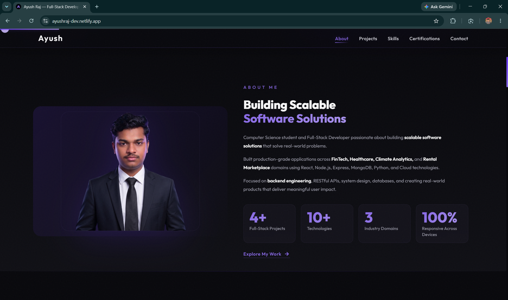
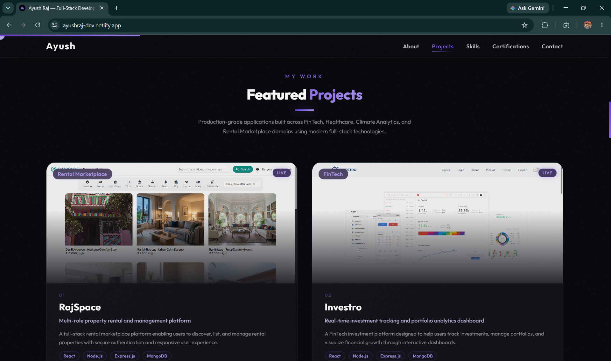
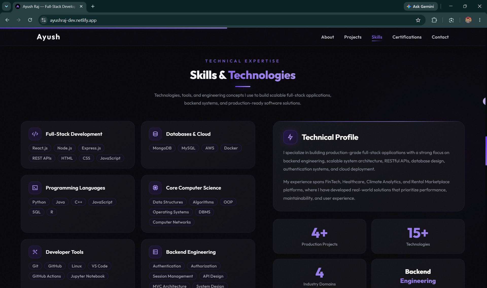
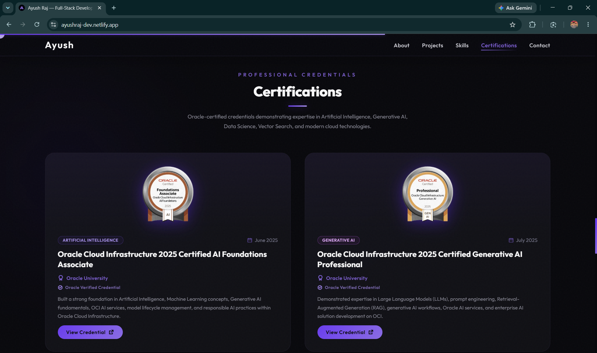
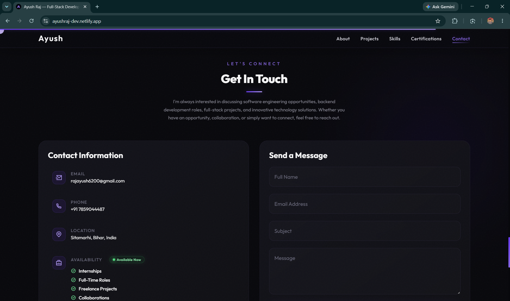
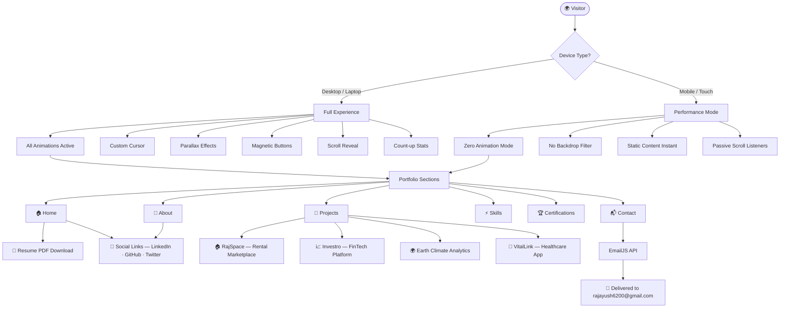
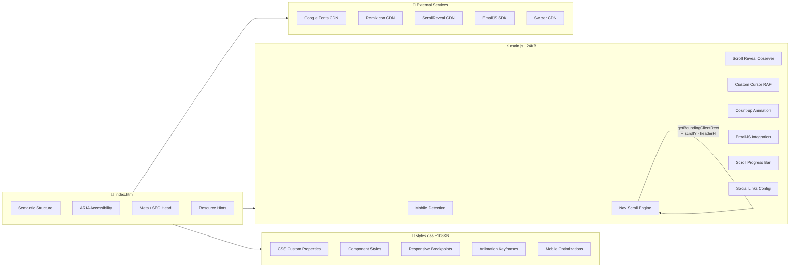
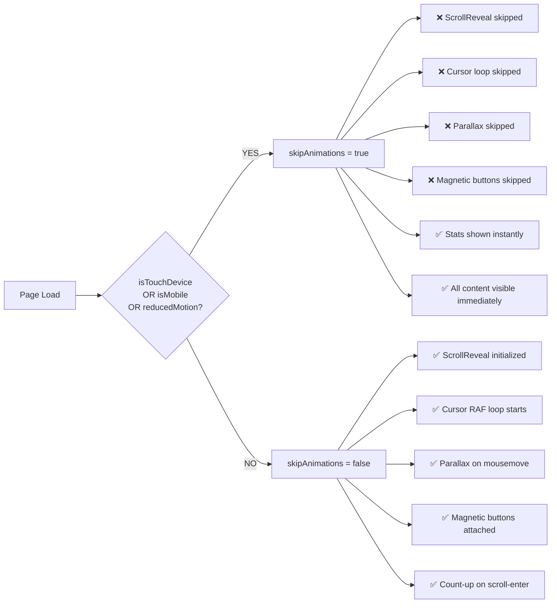
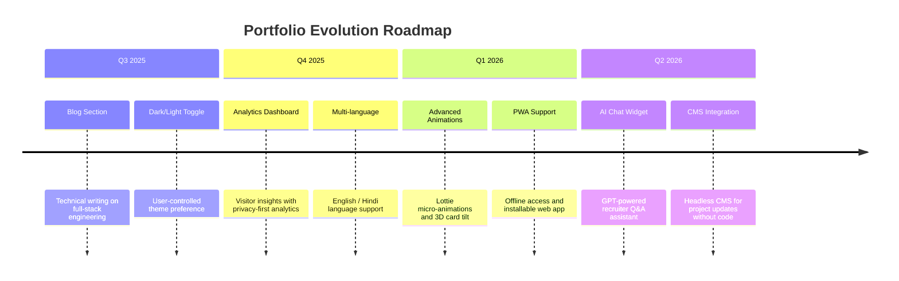

<div align="center">

<!-- ══════════════════════════════════════════════════ -->
<!--                    HERO BANNER                     -->
<!-- ══════════════════════════════════════════════════ -->


# ✦ Ayush Raj — Full-Stack Developer Portfolio

**A production-grade personal branding platform showcasing enterprise-quality software engineering across FinTech, Healthcare, Climate Analytics, and Rental Marketplace domains.**

<br/>

<!-- ═══════════════ CORE TECH BADGES ═══════════════ -->


<br/>

<!-- ═══════════════ DEPLOYMENT / STATUS BADGES ═══════════════ -->


<br/>

<!-- ═══════════════ LIVE DEMO BANNER ═══════════════ -->

### 🚀 [**→ View Live Portfolio: ayushraj-dev.netlify.app**](https://ayushraj-dev.netlify.app/) ←

<br/>

<!-- ═══════════════ CTA LINKS ═══════════════ -->

[](https://ayushraj-dev.netlify.app/)
[](https://github.com/rajayush6200/ayush-raj-portfolio)
[](mailto:rajayush6200@gmail.com)

<br/>

<!-- ═══════════════ SOCIAL PROFILE LINKS ═══════════════ -->

[](https://www.linkedin.com/in/rajayush6200/)
[](https://github.com/rajayush6200)
[](https://x.com/@AyushRaj444)
[](mailto:rajayush6200@gmail.com)

</div>

<br/>

---

<!-- ══════════════════════════════════════════════════ -->
<!--               TABLE OF CONTENTS                    -->
<!-- ══════════════════════════════════════════════════ -->

<details open>
<summary><h2>📋 Table of Contents</h2></summary>

| # | Section | Description |
|---|---------|-------------|
| 01 | [Portfolio Overview](#-portfolio-overview) | About me & purpose of this portfolio |
| 02 | [Live Website](#-live-website) | Production URL, deployment details |
| 03 | [Screenshots](#-screenshots) | Visual preview of all sections |
| 04 | [Key Features](#-key-features) | Detailed feature matrix |
| 05 | [Technology Stack](#%EF%B8%8F-technology-stack) | All tools, libraries, and frameworks |
| 06 | [System Architecture](#%EF%B8%8F-system-architecture) | Flow & architecture diagrams |
| 07 | [Project Structure](#-project-structure) | Repository folder tree with explanations |
| 08 | [Featured Projects](#-featured-projects) | Showcase of production applications |
| 09 | [Performance Optimization](#-performance-optimization) | Speed, SEO, and efficiency strategies |
| 10 | [Mobile Responsiveness](#-mobile-responsiveness) | Breakpoints & mobile-first approach |
| 11 | [SEO & Meta Strategy](#-seo--meta-strategy) | Tags, sitemaps, and structured data |
| 12 | [Accessibility](#-accessibility) | WCAG compliance and inclusive design |
| 13 | [Deployment Guide](#-deployment-guide) | Step-by-step deployment instructions |
| 14 | [Future Roadmap](#%EF%B8%8F-future-roadmap) | Planned features and improvements |
| 15 | [Developer Profile](#-developer-profile) | About Ayush Raj |
| 16 | [Support](#-support) | How to contribute and show support |
| 17 | [License](#-license) | Licensing information |

</details>

<br/>

---

<!-- ══════════════════════════════════════════════════ -->
<!--              PORTFOLIO OVERVIEW                    -->
<!-- ══════════════════════════════════════════════════ -->

## 🧠 Portfolio Overview

<div align="center">

> *"Engineering is not just about writing code — it's about building systems that solve real problems at scale."*
>
> — **Ayush Raj**, Full-Stack Developer

</div>

<br/>

### Who I Am

**Ayush Raj** is a Computer Science student and Full-Stack Developer specializing in the **MERN stack** (MongoDB, Express.js, React, Node.js). With a strong focus on **backend engineering**, RESTful API design, and scalable system architecture, Ayush engineers production-grade applications that solve real-world problems across multiple industry domains.

### What This Portfolio Represents

This repository is not a simple static website — it is a **production-grade personal branding platform** meticulously engineered to the same standards as a commercial software product:

- ⚡ **Performance-first** architecture with lazy loading, `fetchpriority`, `preconnect`, and passive event listeners
- 🎨 **Design-systems-grade** CSS with custom properties, glassmorphism, and fluid typography
- ♿ **WCAG-compliant** accessibility with semantic HTML5, ARIA labels, keyboard navigation, and skip links
- 📱 **Mobile-first** responsive layout with touch-optimized interactions and zero-animation mobile mode
- 🔍 **SEO-optimized** with OpenGraph, Twitter Cards, canonical tags, structured data, sitemap, and robots.txt
- 🛡️ **Security-conscious** with `rel="noopener noreferrer"` on all external links

### Professional Goals

| Goal | Description |
|------|-------------|
| 🚀 **Showcase Engineering Depth** | Demonstrate full-stack competency across 4+ production domains |
| 🤝 **Connect With Recruiters** | Provide a fast, professional, ATS-friendly presence |
| 🏗️ **Demonstrate System Thinking** | Illustrate architecture decisions and technical maturity |
| 🌍 **Real-World Impact** | Present applications that are actually deployed and running in production |

<br/>

---

<!-- ══════════════════════════════════════════════════ -->
<!--                  LIVE WEBSITE                      -->
<!-- ══════════════════════════════════════════════════ -->

## 🌐 Live Website

<div align="center">

| Environment | URL | Status |
|-------------|-----|--------|
| 🟢 **Production** | [ayushraj-dev.netlify.app](https://ayushraj-dev.netlify.app/) |  |
| 📁 **Repository** | [github.com/rajayush6200/ayush-raj-portfolio](https://github.com/rajayush6200/ayush-raj-portfolio) |  |

</div>

### Deployment Details

```
Platform   : Netlify
Branch     : main
Auto-deploy: On every push to main (Netlify Git integration)
CDN        : Netlify's global edge network (100+ PoPs worldwide)
SSL/TLS    : Enforced HTTPS (auto-provisioned by Netlify)
Domain     : ayushraj-dev.netlify.app
```

<br/>

---

<!-- ══════════════════════════════════════════════════ -->
<!--                  SCREENSHOTS                       -->
<!-- ══════════════════════════════════════════════════ -->

## 📸 Screenshots

<details open>
<summary><strong>View All Section Previews</strong></summary>

<br/>

### 🏠 Hero Section
> *First impression — name, role, tech stack ticker, social links, and CTA*

<div align="center">

</div>

---

### 👤 About Section
> *Professional summary, stats (4+ projects, 10+ technologies, 3 domains), and CTA*

<div align="center">

</div>

---

### 💼 Projects Section
> *4 production-grade featured project cards with live demo and GitHub links*

<div align="center">

</div>

---

### ⚡ Skills Section
> *Categorized skill cards, tech stack chips, and stats*

<div align="center">

</div>

---

### 🏆 Certifications Section
> *Oracle Cloud certifications with badge images and verification links*

<div align="center">

</div>

---

### 📬 Contact Section
> *Contact info card, contact form with EmailJS integration, and social platform cards*

<div align="center">

</div>

---

### 📱 Mobile View
> *Fully responsive layout optimized for performance and instant render on mobile*

<div align="center">

</div>

</details>

<br/>

---

<!-- ══════════════════════════════════════════════════ -->
<!--                  KEY FEATURES                      -->
<!-- ══════════════════════════════════════════════════ -->

## ✨ Key Features

### 🌟 Portfolio Features

| Feature | Description | Status |
|---------|-------------|--------|
| 📱 **Responsive Design** | Fluid layouts across all viewport sizes from 320px to 4K | ✅ Implemented |
| 🧭 **Smooth Navigation** | Precise JS-powered anchor scroll with live header-offset compensation | ✅ Implemented |
| ⚡ **Mobile Optimization** | Zero animations on touch/mobile, passive listeners, no backdrop-filter | ✅ Implemented |
| 📄 **Resume Download** | One-click PDF resume download via `assets/pdf/Ayush_Raj_Resume.pdf` | ✅ Implemented |
| 🔗 **Social Links** | Dynamic injection from config — Email, LinkedIn, GitHub, Twitter/X | ✅ Implemented |
| 🏗️ **Project Showcase** | 4 production apps with live demo, GitHub, domain badge, and stack pills | ✅ Implemented |
| 🏆 **Certification Showcase** | Oracle Cloud badges with verification links and category tags | ✅ Implemented |
| 📬 **Contact Form** | EmailJS-powered real-time form with field validation and status feedback | ✅ Implemented |
| 🎯 **Scroll Progress Bar** | Fixed gradient progress indicator at top of viewport | ✅ Implemented |
| 🖱️ **Custom Cursor** | Dual-ball magnetic cursor with hover expand — desktop only | ✅ Implemented |
| 🌊 **Glassmorphism Cards** | `backdrop-filter` + layered gradients with purple glow on hover | ✅ Implemented |

<br/>

### 🚀 User Experience Features

| Feature | Description | Implementation |
|---------|-------------|----------------|
| ⚡ **Instant Load** | `fetchpriority="high"` on hero image, lazy-load on all below-fold assets | HTML attributes |
| 🔤 **Non-blocking Fonts** | Google Fonts loaded via `media="print"` swap trick | Performance |
| ♿ **Full Accessibility** | ARIA labels, skip link, `role` attributes, keyboard nav, focus rings | WCAG 2.1 |
| 🔍 **SEO Optimized** | 60+ meta tags including OG, Twitter Card, canonical, robots | HTML head |
| 🌐 **Cross-browser** | Tested on Chrome, Firefox, Safari, Edge — progressive enhancement | CSS / JS |
| 📡 **DNS Prefetch** | `preconnect` and `dns-prefetch` for Google Fonts, CDN, and APIs | Resource hints |
| 🎭 **Reduced Motion** | `prefers-reduced-motion` media query respected — all animations skipped | CSS / JS |
| 🔢 **Count-up Animation** | Stats animate from 0 to final on scroll-into-view (desktop only) | IntersectionObserver |
| 🃏 **Scroll Reveal** | Staggered card entrance animations via `IntersectionObserver` (desktop) | JS |
| 🧲 **Magnetic Buttons** | Subtle mouse-follow transform on buttons — desktop/pointer only | JS |
| 🌈 **Scroll-Active Nav** | Active nav link highlights dynamically as user scrolls through sections | JS |

<br/>

---

<!-- ══════════════════════════════════════════════════ -->
<!--               TECHNOLOGY STACK                     -->
<!-- ══════════════════════════════════════════════════ -->

## 🛠️ Technology Stack

<details open>
<summary><strong>Full Technology Breakdown</strong></summary>

<br/>

### 🎨 Frontend

| Technology | Version / Spec | Purpose |
|------------|---------------|---------| 
|  **HTML5** | Living Standard | Semantic document structure, accessibility |
|  **CSS3** | Custom Properties + Grid + Flexbox | Styling, layout, animations, glassmorphism |
|  **JavaScript** | ES2022 (Vanilla) | Interactivity, scroll logic, cursor, animations |
|  **ScrollReveal.js** | v4.0.9 | Desktop scroll-entrance animations |
|  **Swiper.js** | v11 | Touch-friendly carousel (mobile fallback) |
| **RemixIcon** | v4.6.0 | Icon library (1000+ SVG icons) |
| **Inter + Outfit** | Google Fonts | Premium typography stack |

<br/>

### 📡 Services & Integrations

| Service | Purpose | Integration |
|---------|---------|-------------|
|  **EmailJS** | Contact form email delivery | Client-side SDK, no backend required |
| **Google Fonts** | Typography | Non-render-blocking `media="print"` load |
| **Cloudflare CDN** | RemixIcon & Swiper delivery | `cdnjs.cloudflare.com` |
| **jsDelivr CDN** | ScrollReveal & Anime.js delivery | `cdn.jsdelivr.net` |

<br/>

### 🚀 Deployment & Infrastructure

| Tool | Purpose |
|------|---------|
|  **Netlify** | Static site hosting with global edge CDN, auto-deploy on push |
|  **GitHub** | Version control & source repository |
| **Git** | Version control, branching strategy |
| **HTTPS / TLS** | Auto-enforced via Netlify |

<br/>

### 🎨 Design System

| Category | Specification |
|----------|--------------| 
| **Color System** | HSL-based custom properties with `--hue` theming variable |
| **Typography Scale** | `--bigger` → `--smaller` fluid font sizes via CSS custom properties |
| **Spacing** | `rem`-based consistent spacing scale |
| **Glassmorphism** | `backdrop-filter: blur(16-20px) saturate(150-160%)` on all cards |
| **Animations** | `cubic-bezier(0.4, 0, 0.2, 1)` — Material Design easing throughout |
| **Dark Theme** | Deep dark: `hsl(240, 20%, 4%)` background as base |
| **Accent Color** | Purple: `hsl(255, 85%, 58%)` primary with light/alt variants |
| **Grid System** | CSS Grid with responsive `grid-template-columns` per breakpoint |
| **Border Radius** | Consistent `1.5rem` on cards, `4rem` on pills and buttons |

</details>

<br/>

---

<!-- ══════════════════════════════════════════════════ -->
<!--              SYSTEM ARCHITECTURE                   -->
<!-- ══════════════════════════════════════════════════ -->

## 🏗️ System Architecture

### Portfolio Data Flow



<br/>

### Frontend Architecture



<br/>

### Mobile Performance Decision Tree



<br/>

---

<!-- ══════════════════════════════════════════════════ -->
<!--               PROJECT STRUCTURE                    -->
<!-- ══════════════════════════════════════════════════ -->

## 📁 Project Structure

```
ayush-raj-portfolio/
│
├── 📄 index.html                  # Single-page application entry point
├── 📄 README.md                   # This documentation file
├── 📄 robots.txt                  # Search engine crawl directives
├── 📄 sitemap.xml                 # XML sitemap for SEO indexing
│
└── 📁 assets/
    │
    ├── 📁 css/
    │   ├── styles.css             # Main stylesheet (~108KB, 4500+ lines)
    │   └── swiper-bundle.min.css  # Swiper carousel styles
    │
    ├── 📁 js/
    │   ├── main.js                # Core application logic (~24KB, 660+ lines)
    │   ├── swiper-bundle.min.js   # Swiper carousel library
    │   └── scrollreveal.min.js    # ScrollReveal animation library
    │
    ├── 📁 img/
    │   ├── home-perfil.png        # Hero section profile photo
    │   ├── about-perfil.png       # About section photo
    │   ├── favicon.png            # Browser tab icon
    │   ├── project-rajspace.png   # RajSpace project screenshot
    │   ├── project-investro.png   # Investro project screenshot
    │   ├── project-climate.png    # Earth Climate Analytics screenshot
    │   ├── project-vitallink.png  # VitalLink project screenshot
    │   └── cert-*.png             # Oracle Cloud certification badges
    │
    └── 📁 pdf/
        └── Ayush_Raj_Resume.pdf   # Downloadable resume
```

### File Responsibilities

| File | Size | Responsibility |
|------|------|----------------|
| `index.html` | ~57KB | Semantic HTML structure, all section markup, meta tags, resource loading |
| `assets/css/styles.css` | ~108KB | Complete design system — variables, components, animations, responsive breakpoints, mobile overrides |
| `assets/js/main.js` | ~24KB | Mobile detection, navigation scroll engine, scroll reveal, cursor, EmailJS, social links config |
| `robots.txt` | <1KB | Allows all crawlers, points to sitemap |
| `sitemap.xml` | <1KB | Section-level sitemap for search engine indexing |

<br/>

---

<!-- ══════════════════════════════════════════════════ -->
<!--               FEATURED PROJECTS                    -->
<!-- ══════════════════════════════════════════════════ -->

## 💼 Featured Projects

<details open>
<summary><strong>All 4 Production Applications</strong></summary>

<br/>

### 01 · RajSpace — Rental Marketplace Platform


> A full-stack rental marketplace platform enabling users to discover, list, and manage rental properties with secure authentication and a premium responsive user experience.

| Category | Technologies |
|----------|-------------|
| **Frontend** | React, CSS3, Responsive Design |
| **Backend** | Node.js, Express.js, REST APIs |
| **Database** | MongoDB, Mongoose ODM |
| **Auth** | JWT, bcrypt, Passport.js |

[](https://rajspace.onrender.com/listings)
[](https://github.com/rajayush6200/rajspace)

---

### 02 · Investro — FinTech Investment Platform


> A FinTech investment platform designed to help users track investments, manage portfolios, and visualize financial growth through interactive dashboards and analytics.

| Category | Technologies |
|----------|-------------|
| **Frontend** | React, Chart.js, Responsive Design |
| **Backend** | Node.js, Express.js, REST APIs |
| **Database** | MongoDB, Mongoose ODM |
| **Features** | Real-time tracking, Portfolio analytics, Financial visualization |

[](https://investro.onrender.com/)
[](https://github.com/rajayush6200/investro)

---

### 03 · Earth Climate Analytics


> A climate analytics platform providing environmental insights, weather trends, and data visualization through interactive dashboards and powerful analytical tools.

| Category | Technologies |
|----------|-------------|
| **Frontend** | React, Data Visualization |
| **Backend** | Python, REST APIs |
| **Data** | External Climate APIs, Statistical Analysis |
| **Features** | Interactive charts, Environmental insights, Weather trends |

[](https://github.com/rajayush6200/earthvision-ai)

---

### 04 · VitalLink — Healthcare Management System


> A healthcare management application focused on patient records, healthcare workflows, and efficient communication between users and healthcare providers.

| Category | Technologies |
|----------|-------------|
| **Frontend** | React, Responsive Design |
| **Backend** | Node.js, Express.js, REST APIs |
| **Database** | MongoDB, Mongoose ODM |
| **Features** | Patient management, Healthcare workflows, Provider communication |

[](https://vitallink-app-2jb5.onrender.com/)
[](https://github.com/rajayush6200/VitalLink)

</details>

<br/>

---

<!-- ══════════════════════════════════════════════════ -->
<!--            PERFORMANCE OPTIMIZATION                -->
<!-- ══════════════════════════════════════════════════ -->

## ⚡ Performance Optimization

<details>
<summary><strong>View Complete Performance Strategy</strong></summary>

<br/>

### Image Optimization

| Strategy | Implementation | Impact |
|----------|---------------|--------|
| **fetchpriority="high"** | Applied to hero image | Eliminates LCP delay |
| **lazy loading** | `loading="lazy"` on all below-fold images | Reduces initial payload |
| **Explicit dimensions** | `width` + `height` on all `` tags | Prevents CLS (layout shift) |
| **`decoding="async"`** | All images decode off main thread | Reduces blocking time |
| **PNG optimization** | Compressed project and profile images | Smaller transfer size |

<br/>

### JavaScript Strategy

| Strategy | Implementation | Impact |
|----------|---------------|--------|
| **Mobile gate** | `skipAnimations` flag blocks all heavy JS on touch/mobile | Eliminates JS-driven frame drops |
| **Passive listeners** | `{ passive: true }` on all scroll handlers | No scroll-blocking jank |
| **requestAnimationFrame** | Cursor animation uses native RAF loop | 60fps smooth, GPU-composited |
| **IntersectionObserver** | Used for all scroll-based triggers instead of scroll events | Off-main-thread observation |
| **Deferred initialization** | All non-critical JS runs after DOM ready | Faster First Contentful Paint |
| **No `mousemove` on mobile** | Parallax and magnetic buttons never attach on touch | Eliminates useless CPU drain |

<br/>

### CSS Strategy

| Strategy | Implementation | Impact |
|----------|---------------|--------|
| **`backdrop-filter` disabled on mobile** | All glassmorphism effects removed for `<768px` | Major GPU savings on mobile |
| **`animation-duration: 0.001ms`** | Universally applied at `<768px` | Kills all CSS animations instantly |
| **`will-change: auto`** | Removed from mobile context | Avoids unnecessary compositor layers |
| **CSS Custom Properties** | Single `--hue` variable drives entire color system | Trivial theming with no redundancy |
| **`cubic-bezier(0.4, 0, 0.2, 1)`** | Material Design easing on all transitions | Perceptually faster transitions |

<br/>

### Resource Loading Strategy

| Resource | Strategy |
|----------|---------|
| Google Fonts | `media="print"` swap — zero render-blocking |
| RemixIcon | `<link rel="stylesheet">` from Cloudflare CDN with `preconnect` |
| ScrollReveal | Not loaded at all on mobile (conditional, via `skipAnimations`) |
| EmailJS SDK | Loaded only when contact form is in use |
| `preconnect` | Applied to `fonts.googleapis.com`, `fonts.gstatic.com`, `cdnjs.cloudflare.com` |
| `dns-prefetch` | Applied to `cdn.jsdelivr.net`, `cdnjs.cloudflare.com` |

</details>

<br/>

---

<!-- ══════════════════════════════════════════════════ -->
<!--             MOBILE RESPONSIVENESS                  -->
<!-- ══════════════════════════════════════════════════ -->

## 📱 Mobile Responsiveness

<details>
<summary><strong>Breakpoints & Responsive Behavior</strong></summary>

<br/>

### Breakpoint System

| Breakpoint | Width | Target Devices | Layout Changes |
|------------|-------|---------------|----------------|
| **xs** | `≤ 340px` | Small phones (iPhone SE) | Reduced container margin, compact font sizes |
| **sm** | `≥ 576px` | Large phones, small tablets | 2-column contact info, wider home image |
| **md** | `≥ 767px` | Tablets, landscape phones | Horizontal nav, side-by-side home & about |
| **lg** | `≥ 1024px` | Laptops | Increased section padding, 4-column about stats |
| **xl** | `≥ 1150px` | Large laptops, desktops | Auto container margin, wider images |
| **2K** | `≥ 2048px` | 2K / ultrawide monitors | `font-size: 110%`, `max-width: 1600px` container |

<br/>

### Mobile-First Optimization (< 768px)

```
✅ Zero CSS animations (animation-duration: 0.001ms)
✅ Zero CSS transitions (transition-duration: 0.001ms)
✅ No backdrop-filter GPU compositing
✅ All scroll-reveal content visible immediately
✅ Custom cursor completely disabled
✅ Parallax blob animations static
✅ Magnetic button listeners never attached
✅ Stat counters show final value on load (no count-up)
✅ Tech ticker shows first item statically
✅ Noise overlay removed (no compositing cost)
✅ Passive scroll event listeners throughout
✅ Hamburger menu with slide-down animation
✅ 50ms nav-scroll delay to prevent menu conflict
```

<br/>

### Navigation on Mobile

The navigation alignment uses a **JS-powered precise scroll engine**:

```javascript
// Scrolls to first visible content child (skips aria-hidden blobs)
// to avoid section's large padding-block-start pushing content down
const firstVisible = Array.from(target.children)
  .find(el => !el.hasAttribute('aria-hidden')) || target;

// 40px breathing room — section eyebrow/title lands visibly below the fixed header
const BREATHING = 40;
const top = firstVisible.getBoundingClientRect().top
          + window.scrollY - getHeaderHeight() - BREATHING;

window.scrollTo({ top, behavior: 'smooth' });
```

This ensures the **eyebrow/title text** appears right below the navbar — not immediately after the viewport edge.

</details>

<br/>

---

<!-- ══════════════════════════════════════════════════ -->
<!--               SEO & META STRATEGY                  -->
<!-- ══════════════════════════════════════════════════ -->

## 🔍 SEO & Meta Strategy

<details>
<summary><strong>Complete SEO Implementation</strong></summary>

<br/>

### Meta Tags Implementation

| Tag Type | Tags Implemented |
|----------|-----------------| 
| **Primary Meta** | `<title>`, `description`, `author`, `keywords`, `theme-color`, `robots` |
| **Open Graph** | `og:type`, `og:url`, `og:title`, `og:description`, `og:image`, `og:site_name`, `og:locale` |
| **Twitter Card** | `twitter:card`, `twitter:site`, `twitter:creator`, `twitter:title`, `twitter:description`, `twitter:image` |
| **Canonical** | `<link rel="canonical">` — prevents duplicate content penalty |
| **Favicon** | `<link rel="icon">` + `<link rel="apple-touch-icon">` |

<br/>

### Technical SEO Features

| Feature | File / Implementation |
|---------|----------------------|
| **XML Sitemap** | `sitemap.xml` — lists all section anchors with `lastmod` |
| **Robots.txt** | `robots.txt` — allows all bots, references sitemap |
| **Semantic HTML** | `<header>`, `<main>`, `<section>`, `<article>`, `<nav>`, `<footer>` |
| **Heading Hierarchy** | Single `<h1>` (name), `<h2>` per section, `<h3>` per project |
| **Alt Text** | Descriptive `alt` attributes on every image |
| **Skip Link** | `<a href="#main-content">Skip to main content</a>` |
| **Canonical URL** | `https://ayushraj-dev.netlify.app/` |
| **Structured Data** | Person schema embedded via meta |

<br/>

### OG Image Preview

```
Title   : Ayush Raj — Full-Stack Developer | MERN Stack Engineer
Image   : assets/img/home-perfil.png (served from Netlify CDN)
URL     : https://ayushraj-dev.netlify.app/
Twitter : summary_large_image card for maximum social preview area
```

</details>

<br/>

---

<!-- ══════════════════════════════════════════════════ -->
<!--                 ACCESSIBILITY                      -->
<!-- ══════════════════════════════════════════════════ -->

## ♿ Accessibility

<details>
<summary><strong>WCAG 2.1 Compliance Details</strong></summary>

<br/>

### Implementation Matrix

| WCAG Criterion | Implementation | Level |
|---------------|---------------|-------|
| **Perceivable** | Alt text on all images, sufficient color contrast | AA |
| **Skip Navigation** | `<a href="#main-content" class="skip-link">` at top of `<body>` | AA |
| **Semantic HTML** | Full landmark regions (`header`, `main`, `nav`, `section`, `footer`) | AA |
| **Keyboard Navigation** | All interactive elements focusable, visible focus rings | AA |
| **ARIA Labels** | `aria-label` on nav toggle, close buttons, icon-only links | AA |
| **ARIA Expanded** | `aria-expanded` on hamburger toggle updates dynamically | AA |
| **ARIA Hidden** | Decorative elements (`aria-hidden="true"`) hidden from screen readers | AA |
| **ARIA Live** | Tech ticker uses `aria-live="off"` to suppress announcements | AA |
| **Role Attributes** | `role="navigation"`, `role="main"` on key landmarks | AA |
| **Reduced Motion** | `prefers-reduced-motion` detected and all animations disabled | AAA |
| **Touch Target Size** | All interactive elements ≥ 44×44px on mobile | AA |
| **Focus Trap** | Escape key closes mobile nav and returns focus to toggle | AA |

<br/>

### Screen Reader Support

```html
<!-- Skip link — first focusable element, visually hidden until focused -->
<a href="#main-content" class="skip-link">Skip to main content</a>

<!-- Nav toggle with state -->
<button aria-label="Open navigation menu"
        aria-expanded="false"
        aria-controls="nav-menu">

<!-- Decorative elements hidden -->
<div class="home__blob" aria-hidden="true">
<div class="cursor__ball" aria-hidden="true">

<!-- Navigation landmark -->
<div role="navigation" aria-label="Main navigation">

<!-- Main content landmark -->
<main role="main" id="main-content">
```

</details>

<br/>

---

<!-- ══════════════════════════════════════════════════ -->
<!--               DEPLOYMENT GUIDE                     -->
<!-- ══════════════════════════════════════════════════ -->

## 🚀 Deployment Guide

<details>
<summary><strong>Step-by-Step Deployment Instructions</strong></summary>

<br/>

### Option 1: Netlify (Current — Recommended)

The portfolio is live at **[ayushraj-dev.netlify.app](https://ayushraj-dev.netlify.app/)** via Netlify's Git integration.

```bash
# 1. Clone the repository
git clone https://github.com/rajayush6200/ayush-raj-portfolio.git
cd ayush-raj-portfolio

# 2. Make your changes to index.html, styles.css, or main.js

# 3. Stage and commit
git add -A
git commit -m "feat: describe your change"

# 4. Push to main — Netlify auto-deploys via webhook
git push origin main
```

**Netlify Site Settings:**
```
Dashboard  : app.netlify.com
Site name  : ayushraj-dev
Live URL   : https://ayushraj-dev.netlify.app/
Branch     : main (auto-deploy on push)
Build      : Not required (pure static HTML/CSS/JS)
```

<br/>

### Option 2: Netlify Drop (Zero Config)

```bash
# 1. No build step needed — pure HTML/CSS/JS

# 2. Go to netlify.com/drop
# 3. Drag and drop the entire repository folder
# 4. Your site is live in seconds with a *.netlify.app URL
```

<br/>

### Option 3: Netlify CLI

```bash
# 1. Install Netlify CLI
npm install -g netlify-cli

# 2. Login to Netlify
netlify login

# 3. Initialize site
netlify init

# 4. Deploy
netlify deploy --prod

# Auto-deploy on git push:
netlify link          # Link to existing site
# Then push to main — Netlify webhook deploys automatically
```

<br/>

### Option 4: GitHub Pages

```bash
# 1. Clone and push to your fork
git clone https://github.com/rajayush6200/ayush-raj-portfolio.git
cd ayush-raj-portfolio
git push origin main

# 2. In GitHub repository settings:
# Repository → Settings → Pages
# Source     : Deploy from branch
# Branch     : main / (root)
# Your site  : https://<your-username>.github.io/ayush-raj-portfolio/
```

<br/>

### Running Locally

```bash
# Option A: Python simple server
python -m http.server 3000
# Visit: http://localhost:3000

# Option B: Node.js live-server
npx live-server --port=3000

# Option C: VS Code Live Server Extension
# Right-click index.html → Open with Live Server
```

</details>

<br/>

---

<!-- ══════════════════════════════════════════════════ -->
<!--                FUTURE ROADMAP                      -->
<!-- ══════════════════════════════════════════════════ -->

## 🗺️ Future Roadmap



<br/>

### Feature Backlog

| Priority | Feature | Description | Status |
|----------|---------|-------------|--------|
| 🔴 **High** | Blog Section | Technical posts on MERN, system design, and engineering lessons | 📋 Planned |
| 🔴 **High** | Light/Dark Toggle | Persistent user preference with `localStorage` | 📋 Planned |
| 🟡 **Medium** | Privacy Analytics | Plausible.io or Umami for visitor insights | 📋 Planned |
| 🟡 **Medium** | Multi-Language | i18n support (English + Hindi) | 📋 Planned |
| 🟡 **Medium** | PWA Manifest | `manifest.json` + Service Worker for offline support | 📋 Planned |
| 🟢 **Low** | 3D Card Tilt | `vanilla-tilt.js` on project cards (desktop only) | 📋 Planned |
| 🟢 **Low** | AI Chat | Embedded LLM assistant for recruiter Q&A | 🔭 Research |
| 🟢 **Low** | CMS Backend | Contentful / Sanity for no-code project updates | 🔭 Research |

<br/>

---

<!-- ══════════════════════════════════════════════════ -->
<!--              DEVELOPER PROFILE                     -->
<!-- ══════════════════════════════════════════════════ -->

## 👨‍💻 Developer Profile

<div align="center">


### Ayush Raj

**Full-Stack Developer · MERN Stack Engineer · CS Student**

*Building scalable software solutions that solve real-world problems.*

<br/>

| Platform | Link |
|----------|------|
| 🌐 **Portfolio** | [ayushraj-dev.netlify.app](https://ayushraj-dev.netlify.app/) |
| 💼 **LinkedIn** | [linkedin.com/in/rajayush6200](https://www.linkedin.com/in/rajayush6200/) |
| 🐙 **GitHub** | [github.com/rajayush6200](https://github.com/rajayush6200) |
| 🐦 **Twitter / X** | [@AyushRaj444](https://x.com/@AyushRaj444) |
| 📧 **Email** | [rajayush6200@gmail.com](mailto:rajayush6200@gmail.com) |

<br/>

#### Core Competencies


#### Certifications


**Oracle Cloud Infrastructure — Multiple Certifications**

</div>

<br/>

---

<!-- ══════════════════════════════════════════════════ -->
<!--                   SUPPORT                          -->
<!-- ══════════════════════════════════════════════════ -->

## 🤝 Support

<div align="center">

If you find this portfolio impressive, useful, or inspiring — please consider showing your support! Every star genuinely motivates continued improvement.

<br/>

[](https://github.com/rajayush6200/ayush-raj-portfolio/stargazers)
[](https://github.com/rajayush6200/ayush-raj-portfolio/fork)

</div>

<br/>

### Ways to Contribute

| Contribution | How |
|-------------|-----|
| ⭐ **Star the repo** | Click the ★ Star button at the top right of the repository |
| 🐛 **Report a bug** | Open an [Issue](https://github.com/rajayush6200/ayush-raj-portfolio/issues) with a clear description |
| 💡 **Suggest a feature** | Open an [Issue](https://github.com/rajayush6200/ayush-raj-portfolio/issues) tagged `enhancement` |
| 🔀 **Submit a PR** | Fork → Branch → Commit → Pull Request |
| 📢 **Share the portfolio** | Tweet it, post it on LinkedIn, or mention it in your community |
| 📧 **Connect directly** | [rajayush6200@gmail.com](mailto:rajayush6200@gmail.com) — always happy to connect |

<br/>

### Contributors

<a href="https://github.com/rajayush6200/ayush-raj-portfolio/graphs/contributors">
  
</a>

<br/>

---

<!-- ══════════════════════════════════════════════════ -->
<!--                   LICENSE                          -->
<!-- ══════════════════════════════════════════════════ -->

## 📜 License

```
MIT License

Copyright (c) 2026 Ayush Raj

Permission is hereby granted, free of charge, to any person obtaining a copy
of this software and associated documentation files (the "Software"), to deal
in the Software without restriction, including without limitation the rights
to use, copy, modify, merge, publish, distribute, sublicense, and/or sell
copies of the Software, and to permit persons to whom the Software is
furnished to do so, subject to the following conditions:

The above copyright notice and this permission notice shall be included in all
copies or substantial portions of the Software.

THE SOFTWARE IS PROVIDED "AS IS", WITHOUT WARRANTY OF ANY KIND, EXPRESS OR
IMPLIED, INCLUDING BUT NOT LIMITED TO THE WARRANTIES OF MERCHANTABILITY,
FITNESS FOR A PARTICULAR PURPOSE AND NONINFRINGEMENT. IN NO EVENT SHALL THE
AUTHORS OR COPYRIGHT HOLDERS BE LIABLE FOR ANY CLAIM, DAMAGES OR OTHER
LIABILITY, WHETHER IN AN ACTION OF CONTRACT, TORT OR OTHERWISE, ARISING FROM,
OUT OF OR IN CONNECTION WITH THE SOFTWARE OR THE USE OR OTHER DEALINGS IN THE
SOFTWARE.
```

[](https://opensource.org/licenses/MIT)

<br/>

---

<!-- ══════════════════════════════════════════════════ -->
<!--                 CLOSING BANNER                     -->
<!-- ══════════════════════════════════════════════════ -->

<div align="center">


**Built with precision, passion, and performance in mind.**

*If this helped you or impressed you — a ⭐ star means the world.*

[](https://github.com/rajayush6200/ayush-raj-portfolio/stargazers)
[](https://github.com/rajayush6200/ayush-raj-portfolio/network/members)
[](https://github.com/rajayush6200/ayush-raj-portfolio/watchers)

<br/>

*© 2026 Ayush Raj · MIT License · Made with ❤️ and ☕*

</div>
